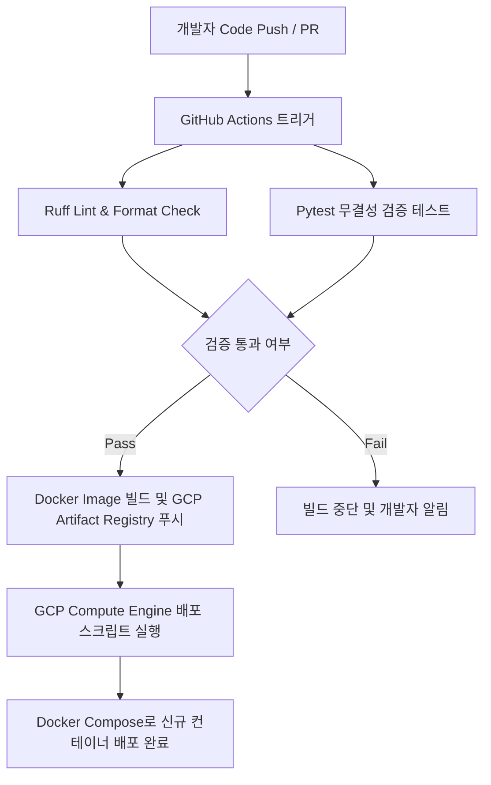

# 하이브리드 RAG 에이전트 시스템 MVP 구축 기획서
본 기획서는 제주올레 가이드북 데이터를 활용한 하이브리드 RAG 에이전트 시스템 MVP의 아키텍처 및 구현 사양을 정의합니다.

## 1. 프로젝트 개요 및 배경
제주올레 여행자들에게 신뢰할 수 있는 코스 안내 및 맞춤형 정보를 제공하기 위해 **RAG (Retrieval-Augmented Generation) 에이전트 시스템** 을 구축합니다.
- **배경**: 기존 LLM의 환각(Hallucination) 현상을 극복하고 실시간에 가까운 정확한 올레길 정보를 제공해야 합니다.
- **목적**: 검증된 공식 문서인 **제주올레 가이드북** 을 단일 원천으로 하여 RDB 메타데이터와 pgvector 기반 벡터 검색을 연동한 하이브리드 검색 엔진을 완성합니다.
- **범위**: MVP 단계에서는 공식 가이드북의 핵심 코스 정보를 파싱하며, 가이드북에 포함된 고정된 10개의 휠체어 구간 데이터는 별도로 동적 파싱하지 않고 데이터베이스 초기화 시 정적 시딩(Seed)으로 적재합니다. 스페셜 테마 정보는 범위에서 제외합니다.

## 2. 하이브리드 인프라 & 데이터 아키텍처 스펙
시스템 인프라와 데이터 구조는 확장성과 실시간 쿼리 효율성을 극대화하도록 구성합니다.

### 인프라 아키텍처 개요
개발 및 배포 프로세스는 자동화된 CI/CD 파이프라인과 컨테이너 환경을 활용합니다.
| 구분 | 기술 스택 | 세부 역할 |
| --- | --- | --- |
| 버전 관리 & CI | GitHub & GitHub Actions | 코드 저장소 관리 및 빌드/테스트 자동화 수행 |
| 호스팅 인프라 | GCP Compute Engine | VM 인스턴스 기반의 가상 환경 제공 |
| 애플리케이션 배포 | Docker & Docker Compose | 독립된 컨테이너 환경에서 서비스 패키징 및 실행 |
| 데이터베이스 | Supabase Cloud | 클라우드 기반 Postgres 엔진 및 pgvector 지원 |

### 데이터 아키텍처 및 DDL 설계
Supabase Cloud 상에 구축되는 데이터베이스는 구조화된 관계형 데이터와 비구조화된 텍스트 임베딩을 동시에 관리하는 **하이브리드 데이터 모델** 을 따릅니다.
```sql
-- pgvector 익스텐션 활성화
CREATE EXTENSION IF NOT EXISTS vector;

-- 1. 코스 메타데이터 테이블 (RDB)
CREATE TABLE courses (
    id SERIAL PRIMARY KEY,
    course_name VARCHAR(100) NOT NULL UNIQUE,
    total_distance_km NUMERIC(4, 1) NOT NULL,
    estimated_time_hours NUMERIC(3, 1) NOT NULL,
    start_point VARCHAR(255) NOT NULL,
    end_point VARCHAR(255) NOT NULL,
    created_at TIMESTAMP WITH TIME ZONE DEFAULT CURRENT_TIMESTAMP
);

-- 2. 휠체어 구간 정보 테이블 (RDB)
CREATE TABLE wheelchair_accessible_segments (
    id SERIAL PRIMARY KEY,
    course_id INTEGER REFERENCES courses(id) ON DELETE CASCADE,
    segment_name VARCHAR(255) NOT NULL,
    start_address VARCHAR(255) NOT NULL,
    distance_km NUMERIC(3, 1) NOT NULL,
    difficulty_level VARCHAR(10) NOT NULL CHECK (difficulty_level IN ('상', '중', '하')),
    created_at TIMESTAMP WITH TIME ZONE DEFAULT CURRENT_TIMESTAMP
);

-- 3. 코스 본문 텍스트 청크 및 벡터 테이블 (pgvector)
CREATE TABLE course_chunks (
    id SERIAL PRIMARY KEY,
    course_id INTEGER REFERENCES courses(id) ON DELETE CASCADE,
    title VARCHAR(255) NOT NULL,
    content TEXT NOT NULL,
    embedding VECTOR(1536), -- OpenAI text-embedding-3-small 기준 1536 차원
    created_at TIMESTAMP WITH TIME ZONE DEFAULT CURRENT_TIMESTAMP
);
```

## 3. 단일 PDF 기반 하이브리드 인제스천 파이프라인 설계
가이드북 PDF에서 유의미한 텍스트 정보를 추출하여 Supabase 데이터베이스에 저장하는 파이프라인 설계입니다.

### 인제스천 파이프라인 처리 흐름
인제스천 과정은 데이터 추출, 전처리, 청킹, 임베딩 생성 및 로드 단계로 세분화됩니다.
- **데이터 추출 (Extract)**: PyPDF 또는 PDFPlumber 라이브러리를 사용하여 단일 PDF 파일의 텍스트를 로드합니다. 이때 스페셜 테마 정보 페이지는 사전에 정의된 페이지 범위를 기반으로 제외합니다.
- **파싱 규칙 (Parse Rules)**:
  - **영문 코스 헤더 패턴 인식**: 각 코스의 시작을 감지하기 위해 `Course \d{1,2}(-\d)?` 형태의 정규식을 사용합니다. (예: "Course 01", "Course 18-1" 등)
  - **소제목(―) 기점 청킹**: 추출된 코스 본문 내에서 소제목 구분 기호인 `―` (엠 대시)를 감지하여 텍스트를 논리적인 청크(Chunk) 단위로 분할합니다. 이를 통해 문맥이 단절되지 않는 최적의 의미 단위를 유지합니다.
  - **휠체어 구간 정적 시딩**: 가이드북의 핵심 코스 정보에 포함된 고정 10개의 휠체어 구간 정보는 정규식 파싱 대신 데이터베이스 마이그레이션 및 초기 셋업 단계에서 고정 Seed SQL 스크립트를 통해 RDB 테이블에 직접 적재합니다.
- **임베딩 및 적재 (Embed & Load)**: OpenAI 임베딩 API를 통해 1536 차원의 벡터를 생성하고 Supabase Cloud 데이터베이스에 적재합니다.

### 인제스천 파이프라인 디렉터리 구조
```text
jeju-olle-docent/
├── .github/
│   └── workflows/
│       └── ci.yml               # GitHub Actions 워크플로우 정의
├── src/
│   ├── ingestion/
│   │   ├── __init__.py
│   │   ├── pdf_extractor.py     # PDF 텍스트 추출 엔진
│   │   ├── parser.py            # 헤더 패턴 및 소제목 청킹 파서
│   │   └── database_loader.py   # Supabase 적재 모듈
│   ├── models/
│   │   └── schema.py            # 데이터 검증용 Pydantic 모델
│   └── main.py                  # 파이프라인 실행 진입점
├── tests/
│   ├── test_parser.py           # 파서 단위 테스트
│   ├── test_wheelchair.py       # 휠체어 정적 데이터 무결성 검증 테스트
│   └── test_db_loader.py        # DB 적재 단위 테스트
├── data/
│   └── jeju_olle_guidebook.pdf  # 원천 단일 PDF 파일
├── Dockerfile                   # GCP 배포용 Docker 이미지 빌드 파일
├── docker-compose.yml           # 컨테이너 오케스트레이션 설정
├── pyproject.toml               # Ruff 및 프로젝트 설정 파일
└── requirements.txt             # Python 의존성 라이브러리 목록
```

## 4. GitHub CI/CD 및 코드 품질 관리 전략 (Ruff/Pytest)
시스템의 코드 품질과 파이프라인 무결성을 보장하기 위해 강력한 자동화 테스트를 도입합니다.

### 코드 품질 관리 도구 및 규칙
- **Ruff**: 기존의 Flake8, Black, isort 등을 대체하는 초고속 린터 및 포매터입니다. PEP 8 규칙 준수 여부 및 불필요한 임포트 선언을 자동으로 모니터링하고 수정합니다.
- **Pytest**: 테스트 주도 개발(TDD) 방법론을 지원하며, 인제스천 파이프라인의 데이터 무결성을 검증합니다.

### 무결성 검증 테스트 항목
- **코스 헤더 검증**: 파싱된 코스 개수가 실제 가이드북의 코스 목록(예: 총 27개 코스)과 정확히 일치하는지 확인합니다.
- **휠체어 정적 데이터 검증**: 시딩(Seed)되는 휠체어 구간 10개의 명세가 Pydantic 모델(`WheelchairSegmentSchema`)에 부합하고, 필수 값들이 정확하게 로드되는지 정합성을 검증합니다.
- **임베딩 적재 무결성**: Supabase 데이터베이스에 적재되기 전 임베딩 벡터의 차원이 정확히 1536 차원인지 확인하는 단위 테스트를 수행합니다.

### CI/CD 파이프라인 자동화 흐름


### RAG LLMOps 평가 및 모니터링 전략 (RAGAS & LangSmith)
학기 프로젝트 최종 보고서에 객관적인 에이전트 정확도 수치를 기재하고 개발 중 시각적인 추적을 확보하기 위해 RAGAS 와 LangSmith 연동을 평가 전략으로 도입합니다.
- **RAGAS (정량적 정확성 평가)**:
  - 평가 데이터셋(Golden Dataset): 제주올레 코스 및 휠체어 데이터에 대한 예상 질문, 정답 컨텍스트, 정답 지문(Ground Truth) 20쌍을 미리 설계하여 구축합니다.
  - 핵심 평가 지표: Context Recall(검색 재현율 - 컨텍스트가 정답 정보를 포함하는가), Faithfulness(충실도 - 답변이 컨텍스트에만 근거하고 환각이 없는가), Answer Relevance(답변 유사도 - 답변이 질문 의도에 부합하는가) 3가지 항목을 0.0 ~ 1.0 점수로 정량 평가합니다.
- **LangSmith (시각적 대화 트레이싱)**:
  - 에이전트 구동 과정에서 발생하는 OpenAI API 호출, 임베딩 연산 속도, pgvector DB 조회 소요 시간 및 프롬프트 흐름 전체를 시각화 대시보드로 실시간 모니터링하여 개발 중 병목 현상 및 레이턴시를 디버깅합니다.

## 5. MVP 마일스톤 및 예외 처리(Edge Case) 대응 가이드라인
성공적인 학기 프로젝트 완수를 위해 각 개발 단계의 일정 조율과 예외 상황에 대한 대처 방안을 수립합니다.

### MVP 개발 마일스톤
| 단계 | 개발 태스크 | 산출물 및 검증 기준 | 기간 |
| --- | --- | --- | --- |
| 1단계 | 환경 구축 및 데이터베이스 설계 | CI 설정 완료, Supabase DDL 적용 및 테이블 설계 검증 | 1주차 (1~3일) |
| 2단계 | PDF 파싱 및 인제스천 구현 | 가이드북 PDF 텍스트 추출, 정규식 기반 파서 완료 및 Pytest 검증 | 1주차 (4~7일) |
| 3단계 | RAG 검색 에이전트 연동 | OpenAI 임베딩 및 pgvector 적재 완료, 하이브리드 RAG 검색 구현 | 2주차 (8~11일) |
| 4단계 | 인프라 배포 및 통합 검증 | GCP VM 호스팅, Docker 컨테이너 배포 및 End-to-End 무결성 검증 | 2주차 (12~14일) |

### 예외 처리 (Edge Case) 대응 가이드라인
개발 및 운영 중 발생할 수 있는 주요 예외 상황에 대한 시나리오는 다음과 같이 관리합니다.
- **휠체어 구간 인포그래픽의 변형 패턴**:
  - *상황*: PDF 텍스트 추출 중 인포그래픽 레이아웃이 훼손되거나 텍스트 정렬이 깨져 기본 정규식으로 매칭되지 않는 구간이 발생하는 경우
  - *대응*: 예외 처리 로직(Fallback Rule)을 구현하여 정형화된 정규식 매칭 실패 시 원본 텍스트를 우선 로깅하고 관리자에게 슬랙 알림을 전달하는 경고 시스템을 연동합니다. 또한, 자주 발생하는 변형 패턴에 대응하는 2차, 3차 정규식(Alternative Regex Pattern)을 사전에 정의하여 파싱 성공률을 제어합니다.
- **가이드북 내 스페셜 테마 페이지 유입**:
  - *상황*: MVP 스코프에서 제외된 축제 정보, 맛집 가이드 등의 스페셜 테마 페이지 텍스트가 파이프라인으로 유입되는 경우
  - *대응*: PDF 파싱 시 사전에 제외할 페이지 번호 매핑 리스트(Blacklist Pages)를 하드코딩 또는 설정 파일(YAML)로 분리하고, 파서 진입점 단계에서 해당 페이지의 데이터 추출을 원천 차단합니다.
- **Supabase DB 연결 실패 및 API 레이트 리밋 (Rate Limit)**:
  - *상황*: OpenAI 임베딩 API 호출 및 Supabase 데이터베이스 적재 시 네트워크 순시 장애 또는 API 요청 속도 제한이 발생하는 경우
  - *대응*: 파이프라인의 데이터베이스 로더에 지수 백오프(Exponential Backoff) 기반의 재시도(Retry) 알고리즘을 도입하여 안정적인 트랜잭션을 확보합니다.
